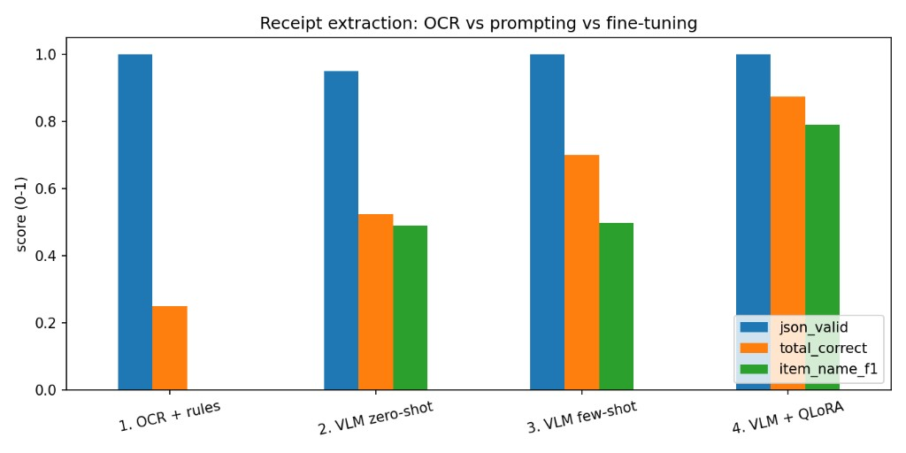

# 🧾 Receipt → JSON: QLoRA fine-tuning a Vision-Language Model

Turn a photo of a receipt into **schema-validated JSON**, by fine-tuning a
2-billion-parameter vision-language model with **QLoRA** on a single free
Colab GPU.

> Created by **Aditya Raj**.

```text
     ┌─────────────┐
     │   receipt   │  →  ViT encoder  →  projector  →  LLM  →  {"items":[…],
     │    photo    │        (sees)      (translates)  (writes)   "total": 48000}
     └─────────────┘                                                    ↓
                                                          Pydantic validation
```

---

## 🎯 The point of this project

Anyone can fine-tune a model and claim it improved. This notebook evaluates
**four approaches on the same held-out receipts**, so the improvement is
measured rather than asserted:

| # | Approach | Trains weights? | Answers the question |
|---|----------|-----------------|----------------------|
| 1 | OCR + rules (Tesseract) | No | *"Why not just use OCR?"* |
| 2 | VLM zero-shot | No | How good is the base model already? |
| 3 | VLM few-shot (2 examples) | No | Can prompting alone close the gap? |
| 4 | **VLM + QLoRA** | Yes, ~1% | Was fine-tuning actually worth it? |

That ladder is the interesting part. Showing *why* fine-tuning was the right
choice is harder — and more convincing — than showing that you can do it.

## 📊 Results

Measured on 40 held-out CORD receipts — identical images, identical prompt,
identical greedy decoding across all four rows.



| Approach | Valid JSON | Total correct | Item name F1 |
|----------|-----------|---------------|--------------|
| OCR + rules | 1.00* | 0.25 | 0.00 |
| VLM zero-shot | 0.95 | 0.52 | 0.49 |
| VLM few-shot | 1.00 | 0.70 | 0.49 |
| **VLM + QLoRA** | **1.00** | **0.87** | **0.79** |

\* Not a merit. The OCR baseline assembles its output with `json.dumps()`, so it
is valid by construction — a reminder to check *how* a metric is produced before
reading anything into it. The honest OCR result is the other two columns: it
recovers a quarter of the totals and **not a single line item**. Tesseract reads
the characters fine; it has no idea which number is a price and which is a phone
number. That is a layout-and-semantics problem, and it is why a neural model
earns its place here.

### The most interesting number is the one that *didn't* move

Few-shot prompting lifted total accuracy substantially (0.52 → 0.70) while item
name F1 sat completely still (0.49 → 0.49).

That is the whole argument for fine-tuning, visible in one row. Two examples in
the prompt teach the model the *shape* of the answer — which is why totals and
JSON validity improve — but they cannot teach it to read a cramped receipt more
carefully. Formatting is cheap to demonstrate; perception is not.

QLoRA is what moved perception: item name F1 went 0.49 → 0.79, a 61% relative
gain, alongside totals reaching 0.87. So fine-tuning was not just *better*, it
was better **at the thing prompting could not fix** — which is a far stronger
justification than a single improved average.

### Where these numbers are unfair

Item names are scored by *exact* match after lowercasing and stripping
punctuation. That is a deliberately strict choice — it makes the metric
unambiguous and cheap to compute — but it means `"ES TEH MANIS"` against
`"ES TEH"` scores zero rather than partial credit. The OCR baseline's flat 0.00
is partly an artefact of that harshness: it does extract *text*, it just never
reproduces a name exactly. A fuzzy criterion would give it some credit and
narrow every gap in the table.

The ranking would not change, which is why the comparison still stands. But a
metric you cannot criticise is usually a metric you have not looked at closely
enough.

---

## 🧠 How a VLM works (and why it replaces a hand-built fusion model)

A vision-language model is three parts:

1. **Vision encoder (ViT)** — splits the image into a grid of patches and turns
   each into a vector. Unlike a CNN that collapses an image to one feature
   vector, this keeps *hundreds of positioned tokens*, so the model can still
   tell where on the receipt something appeared.
2. **Projector** — a small MLP that maps patch vectors into the language
   model's embedding space. This is the learned replacement for hand-written
   feature concatenation, and it is where fusion actually happens.
3. **Language model** — receives a single sequence mixing image tokens and text
   tokens, and generates the answer. Self-attention lets the word "total" attend
   directly to the patch containing the total.

Because the output is generated text, the model can emit JSON — the task
becomes structured generation rather than classification.

### What gets trained

| Component | Frozen? | Why |
|---|---|---|
| Vision encoder | ❄️ frozen | It already reads receipts; the gap is output *format*, not sight |
| Projector | ❄️ frozen | Already aligned by the base model's pretraining |
| Language model | 🔥 LoRA adapters | ~1% of parameters, in 4-bit — this is where the format is learned |

The LoRA target names (`q_proj`, `gate_proj`, …) exist only in the language
model. Qwen2-VL's vision tower uses different names (`qkv`, `fc1`), so it is
excluded automatically — and the notebook asserts that zero vision modules
received adapters.

---

## 🛠️ Fitting this on a free T4

Three constraints drive nearly every hyperparameter:

- **The T4 has no bfloat16.** It is a Turing card, so the notebook detects this
  and selects `float16` instead of hard-coding a dtype.
- **Image tokens dominate memory, not text.** Attention cost grows with the
  *square* of sequence length, so `max_pixels` caps each image at ~256 tokens.
  This matters far more than batch size.
- **4-bit quantization (NF4)** shrinks the frozen base from ~4.4 GB to ~1.5 GB,
  leaving room for activations and gradients.

Plus gradient checkpointing, an 8-bit optimizer, batch size 1 with gradient
accumulation of 8, and a bounded `max_steps` so a Colab session cannot time out
mid-run.

### The memory budget people forget

Fine-tuning discussions fixate on VRAM, but on Colab the **host RAM is the
smaller budget** — roughly 12 GB against the T4's 15 GB. CORD receipts are 2–4
megapixel photos, so 400 of them decoded is several GB before a single weight
has loaded, and the kernel dies during model loading rather than during
training. That makes it look like a GPU problem when it is not.

Three rules keep it in check, all applied in the data section:

- **Downscale on ingest, not at use time.** The processor caps every image at
  `MAX_PIXELS` (~448×448) regardless, so holding a full-size original costs
  tens of MB of RAM to deliver 0.2 MP of usable signal.
- **Store compressed, decode on demand.** A decoded PIL image is an
  *uncompressed* buffer of width × height × 3 bytes — ~2.4 MB at 1024×768,
  against ~150 KB as JPEG. Across ~440 receipts that is the difference between
  roughly 1 GB and 70 MB. Decoding at the point of use costs a few milliseconds
  per training step, which is free beside a forward pass through a 2B model.
- **Never hold two copies.** Building a list of originals and then mapping over
  it to build a second list means both exist at once — peak usage is what kills
  the session, not steady state.

The dataset is streamed rather than downloaded, too: only ~440 of roughly 1000
rows are needed, and converting the full download to Arrow locally is itself a
RAM spike unrelated to the rows we actually want.

The notebook also pins the model to the GPU with `device_map={"": 0}` rather
than `"auto"`. Given tight VRAM, `"auto"` may quietly offload layers to host
RAM, which turns a clean out-of-memory error into a run that is an order of
magnitude slower *and* competes for the RAM the dataset needs. A `memory_report()`
helper prints both budgets at each stage, so this is observable rather than
guesswork.

---

## 📁 Project structure

```
receipt-to-json-vlm/
├── receipt_to_json_qlora.ipynb   # the whole project: data → baselines → QLoRA → eval
├── receipt_schema.py             # Pydantic schema, CORD normaliser, metrics (GPU-free)
├── tests/
│   └── test_receipt_schema.py    # 39 tests, run in CI on every push
├── .github/workflows/tests.yml   # CI: pytest on 3.10 and 3.12
├── requirements.txt
└── .gitignore                    # adapter weights excluded → published to the HF Hub
```

Why is `receipt_schema.py` outside the notebook? Because it needs no GPU, which
means it can be **unit-tested in CI**. Parsing money strings, pulling JSON out
of chatty model output, and scoring predictions are ordinary software with
edge cases — notebooks are a bad place for logic you want to trust.

---

## ▶️ How to run

### Google Colab (recommended)

1. Open `receipt_to_json_qlora.ipynb` in
   [Colab](https://colab.research.google.com/) (File → Open notebook → GitHub).
2. **Runtime → Change runtime type → T4 GPU** (the free tier is enough).
3. **Runtime → Run all.**

Takes roughly 45–60 minutes end to end. If the CORD dataset fails to download,
the notebook generates synthetic receipts instead, so it never dead-ends during
a live demo.

**If Colab reports that the session restarted after the install cell, that is
expected** — the install replaces library versions Colab had already imported.
Run all again; the install is a no-op the second time.

### Tests (no GPU needed)

```bash
pip install pydantic pytest
pytest tests -q
```

---

## 🗃️ Data

[CORD](https://huggingface.co/datasets/naver-clova-ix/cord-v2) — about 1,000
photographed Indonesian receipts with structured ground truth already attached,
so no manual annotation is required.

`normalize_cord()` flattens CORD's nested format into the target schema. This
matters more than it sounds: you cannot score a prediction against a
differently-shaped gold answer, so training targets and model outputs must be
normalised into the same shape first.

Indonesian receipts also write `10.000` to mean ten thousand, so money parsing
handles both `,` and `.` as thousands separators — one of the things the test
suite pins down.

---

## 🔒 Validation, not hope

The model is a probabilistic system feeding a deterministic one. Anything
downstream needs guarantees a model cannot give, so output is parsed, validated
against the Pydantic schema, and retried once before failing **loudly**.

```python
result = extract_receipt(image)
if result.ok:
    save(result.receipt)     # guaranteed to match the schema
else:
    queue_for_human(image, result.error)
```

The stronger version is *constrained decoding* (e.g. Outlines), which makes
invalid JSON structurally impossible rather than something you catch afterwards.
Retry-on-failure is the simpler cousin and a useful thing to compare against.

---

## ⚠️ Honest limitations

- ~400 training examples and 200 steps — a demo run, not a production model.
- One language, one country's receipt conventions.
- No human-in-the-loop review queue, which real document-AI systems need.
- **Receipts contain personal data** — names, partial card numbers, locations,
  purchase history. A real deployment needs a redaction and retention policy,
  and likely local inference rather than a hosted API.

---

## 📝 Resume bullet

> Fine-tuned a 2B-parameter vision-language model with **QLoRA** to convert
> receipt images into **schema-validated JSON**, training ~1% of parameters in
> 4-bit on a single free GPU. Benchmarked against OCR, zero-shot and few-shot
> baselines on 40 held-out receipts: **line-item F1 0.49 → 0.79 and total
> accuracy 0.52 → 0.87**, with few-shot prompting shown to improve formatting
> but not extraction accuracy — isolating what fine-tuning actually contributed.
> Added Pydantic validation with retry, per-field error analysis, and CI-tested
> extraction logic.

## 🔭 Next steps

- Constrained decoding (Outlines) instead of retry-on-failure
- LoRA rank sweep (r = 4/8/16/32) tracked in Weights & Biases
- Confidence scoring to route uncertain extractions to human review
- A Gradio demo on Hugging Face Spaces
